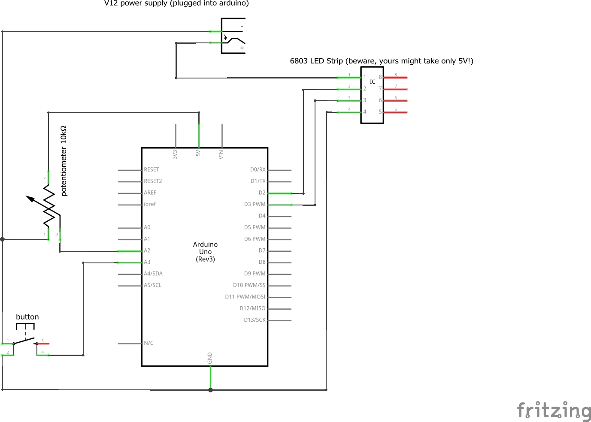

# RainbowStrip
Coloring a 50-pixel (150x LED 5050) addressable RGB LED strip with inbuilt 6803 ICs using an arduino.

Requires:

https://github.com/adafruit/LPD6803-RGB-Pixels

https://github.com/PaulStoffregen/TimerOne

# circuit
